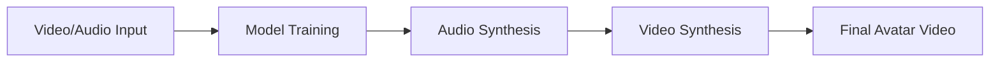

## Overview

Duix Avatar provides a powerful set of Open APIs for local AI avatar creation and video synthesis. After starting the Docker services, several HTTP endpoints are exposed locally at `http://127.0.0.1`, allowing you to integrate avatar creation and video synthesis capabilities into your own applications.

<Note>
All APIs are designed for local-only access with no authentication required. Your data stays completely private and offline.
</Note>

## Available APIs

The Duix Avatar platform exposes three main API endpoints:

<CardGroup cols={3}>
  <Card title="Model Training" icon="graduation-cap" href="/api/model-training">
    Train voice models from audio samples using ASR preprocessing
  </Card>
  <Card title="Audio Synthesis" icon="microphone" href="/api/audio-synthesis">
    Generate speech audio from text using trained voice models
  </Card>
  <Card title="Video Synthesis" icon="video" href="/api/video-synthesis">
    Create lip-synced avatar videos combining audio and video
  </Card>
</CardGroup>

## API Workflow

A typical workflow for creating an AI avatar video involves three steps:

1. **Model Training**: Upload a video/audio file to train a voice model that captures the speaker's unique characteristics
2. **Audio Synthesis**: Use the trained model to generate speech audio from text input
3. **Video Synthesis**: Combine the generated audio with the avatar video to create a lip-synced output



## Service Ports

The following ports are used by the Duix Avatar services:

| Port | Service | Description |
|------|---------|-------------|
| 18180 | TTS Service | Text-to-speech and voice model training |
| 8383 | Face2Face Service | Video synthesis and lip-sync generation |
| 10095 | ASR Service | Automatic speech recognition (internal) |

## Local Access

All APIs are accessible via `http://127.0.0.1` on their respective ports:

- **Model Training & Audio Synthesis**: `http://127.0.0.1:18180`
- **Video Synthesis**: `http://127.0.0.1:8383`

<Warning>
These services are designed for local access only. Do not expose these ports to the internet without proper security measures.
</Warning>

## Getting Started

<Steps>
  <Step title="Start Docker Services">
    Ensure all Docker containers are running:
    ```bash
    cd deploy
    docker-compose up -d
    ```
  </Step>
  
  <Step title="Verify Services">
    Check that all three services are in "Running" status in Docker Desktop
  </Step>
  
  <Step title="Make Your First API Call">
    Start with the [Model Training](/api/model-training) endpoint to create your first voice model
  </Step>
</Steps>

## Next Steps

<CardGroup cols={2}>
  <Card title="Authentication" icon="shield" href="/api/authentication">
    Learn about local-only access and security
  </Card>
  <Card title="Basic Workflow" icon="circle-play" href="/api/examples/basic-workflow">
    Follow a complete example from training to video generation
  </Card>
</CardGroup>